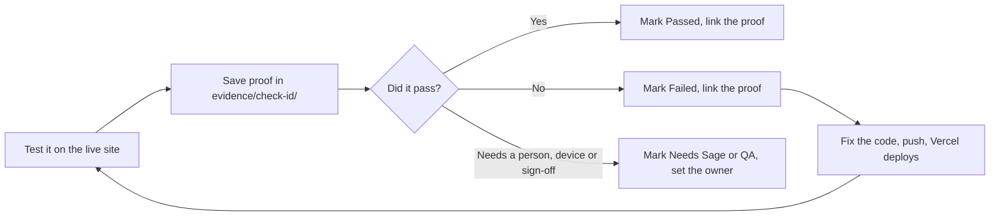

# QA: start here

This folder is how the AI Playbook is checked before release, and the kit for
checking the next project the same way.

- **See the results:** https://aiplaybook-ve.vercel.app/review-tracker/
- **Blank tracker for a new project:** https://aiplaybook-ve.vercel.app/review-tracker/template/

## What gets checked

Two Sage checklists, turned into 67 numbered checks:

- **Manual Testing**: 38 checks (`manual-01` to `manual-38`): how the site looks,
  works and copes: layout, forms, browsers, speed, accessibility.
- **QA Release Checklist**: 29 checks (`release-01` to `release-29`): whether
  it's ready to go live: sign-offs, browsers and devices, no serious bugs left.

The source checklists are internal Sage Confluence pages (*Manual Testing
Checklist* and *QA – Release Checklist*, Sage.com Global Web Development).
**This repository is public, so the PDFs are not stored here.** Ask the project
owner for them.

## How a check gets done



Every status change is kept in the check's history, so a fix stays visible:
*Failed 18 Sep → Passed 23 Sep*, with proof for both.

## What each status means

| Status | Meaning |
|---|---|
| Not assessed | Nobody has checked it yet. |
| Passed | Checked and works as expected, with proof. |
| Failed | Checked and doesn't work yet. Fix it, then re-test. |
| Blocked | Can't be tested yet, e.g. waiting for access. |
| Needs Sage or QA | Needs a decision, a sign-off or a device the tester doesn't have. |
| Not applicable | Doesn't apply to this project, e.g. there's no CMS. |
| Already evidenced | Already proven elsewhere, e.g. by an automated test. Link it. |

## What's in this folder

```
docs/qa/
├─ README.md                 ← you are here
├─ project.json              ← this project's details (name, links, version, testers, dates)
├─ results.json              ← this project's recorded results (baseline for the tracker)
├─ qa-testing-tracker.html   ← this project's tracker as one file (built; open locally)
├─ checklist-runbook.md      ← how to test each of the 67 checks, and what counts as a pass
├─ lessons-learned.md        ← what failed and how to stop it happening next time
├─ template/                 ← the reusable tracker (shared by every project)
│   ├─ tracker.template.html     the page
│   ├─ checks.json               the 67 checks
│   ├─ build.py                  builds the tracker from project.json + results.json
│   └─ publish/                  built copies, ready for /review-tracker/
├─ evidence/                 ← proof
│   ├─ <check-id>/               new evidence: one folder per check (see below)
│   └─ batch-1…5, row-audit/     the first round's evidence (kept where the tracker links to it)
└─ archive/                  ← older trackers and the first template, for reference
```

**Evidence naming** (new evidence): `evidence/manual-06/2026-10-03-FAILED-minus-minutes-accepted.png`
then `evidence/manual-06/2026-10-04-FIXED-minus-minutes-refused.png`. FAILED / FIXED /
PASSED in the name gives the link a matching colour in the tracker.

## Updating the tracker

1. Edit `project.json` (version tested, testers, last checked) or `results.json`.
2. Run `npm run build:review-tracker`. It rebuilds the tracker and copies it into `public/review-tracker/`.
3. Commit and push to `main`; Vercel publishes it.

Results typed into the live page are saved **in that browser only**. To keep
them, use **Share & save → Download editable backup** and fold the results
into `results.json`.

## Copy this to a new project

To QA another site (e.g. the MTD playbook) with the same tracker:

1. Copy `docs/qa/template/` into the new repo's `docs/qa/template/`.
2. Copy `docs/qa/README.md` and `docs/qa/checklist-runbook.md`, then change
   the names, links and page counts to the new project's.
3. Create `docs/qa/project.json` for the new project (start from the one here:
   new name, links, `storageKey`, `started` date; leave `version`,
   `testers` and `lastChecked` to fill in as you go).
4. Don't copy `results.json`: a new project starts with every check "Not assessed".
5. Copy `docs/qa/lessons-learned.md`. Check the new site against it first; those are the known traps.
6. Copy `scripts/generate-review-tracker.mjs` and the `build:qa-template` /
   `build:review-tracker` scripts from `package.json`.
7. Run `npm run build:review-tracker`; the blank tracker appears at `/review-tracker/`.
