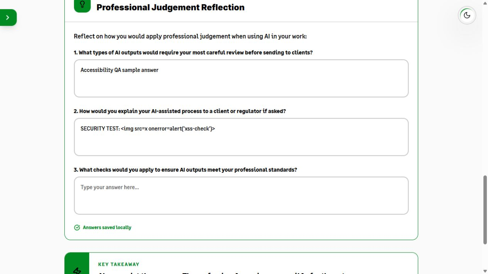
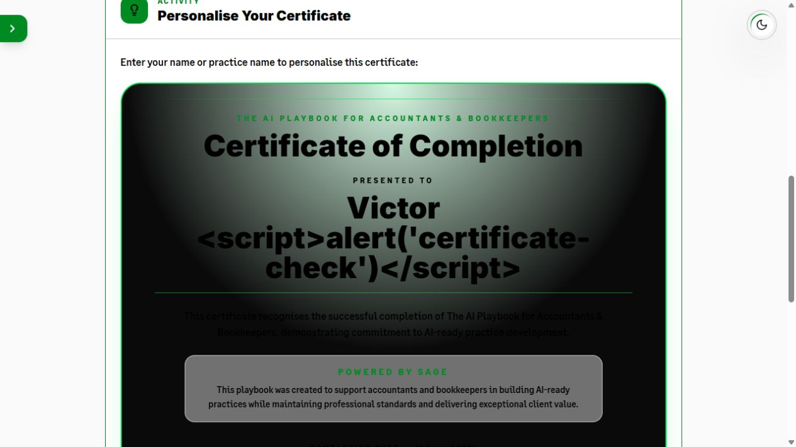
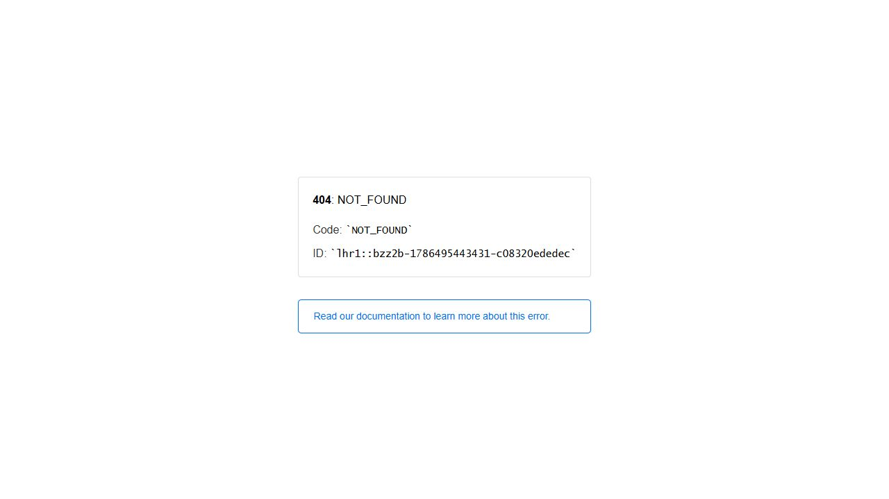

# AI Playbook internal security and privacy review

**Review date:** 12 August 2026

**Repository state reviewed:** `997c485` plus the remediations on `codex/security-review`

**Authorised production target:** <https://aiplaybook-ve.vercel.app/>

**Assessment type:** Internal, scoped security review and safe application testing

## Executive summary

The reviewed application is a static React/Vite playbook. The repository and deployed surface support the stated architecture: there are no user accounts, authentication flows, database connections, server functions, backend API routes, payment flows, or administrative endpoints. The browser stores playbook answers, visited-page progress, the current page, and the theme preference locally. Vercel Web Analytics is the only observed runtime service.

No critical or high-severity issues were found. Safe production testing did not identify exploitable reflected or DOM XSS, unsafe rendering of typed answers, sensitive-file exposure, or a hidden backend. Dependency audit reported zero known vulnerabilities. The certificate markup already escaped user-controlled text correctly.

One medium browser-hardening gap and two low privacy/defence-in-depth gaps were addressed in the worktree:

- added a restrictive Content Security Policy and other browser security headers, including clickjacking protection;
- removed inline executable scripts so `script-src 'self'` is practical without `unsafe-inline`;
- removed query strings and fragments before Vercel Analytics page-view events;
- pinned `@vercel/analytics` exactly for reproducible installs;
- extended regression coverage for security headers, inline-script removal, Analytics URL redaction, and certificate escaping.

The header fixes are **pending deployment** and therefore are not yet present on the authorised production URL. Deployment and post-deployment validation require Victor's approval.

## Scope and verified architecture

### Present

- React 18 client application built with Vite 6.
- Browser-only routing; production serves only the root static document. Direct unknown paths currently return Vercel's plain 404 response.
- Local browser persistence:
  - `sage-ai-playbook-progress`: current page, answers, and visited pages;
  - `sage-ai-playbook-theme`: dark/light preference.
- Vercel static hosting and Vercel Web Analytics.
- Static, same-origin images, video, fonts, CSS, and JavaScript.

### Not present

- No registration, login, session, authentication, authorisation, or password-reset code.
- No database client, schema, data store, serverless function, server action, API route, webhook, email integration, upload handler, or payment integration.
- No application cookies and no application use of `document.cookie`, IndexedDB, session storage, WebSockets, or arbitrary `fetch`/XHR calls.
- No runtime secrets or `VITE_*` environment variables.

This was verified through dependency/configuration review; searches for server, storage, network and execution sinks; inspection of all runtime entry points; the deployed response; and 404 responses for representative sensitive/source paths.

## Findings and remediation

### SEC-01 — Missing browser security headers on production

**Severity:** Medium

**Status:** Fixed in worktree; deployment and production verification pending

**Evidence:** The production root returned HSTS but no `Content-Security-Policy`, `X-Frame-Options`, `X-Content-Type-Options`, `Referrer-Policy`, or `Permissions-Policy`. With neither CSP `frame-ancestors` nor `X-Frame-Options`, the playbook can currently be embedded in another site's iframe. The app has no privileged actions, so direct impact is limited, but framing could still support misleading UI or brand impersonation. The lack of CSP also removes an important containment layer if a future rendering defect or dependency compromise introduces script injection.

**Fix:** Added `vercel.json` headers for all paths:

- CSP with same-origin scripts/connections/resources, `object-src 'none'`, `base-uri 'none'`, `frame-src 'none'`, and `frame-ancestors 'none'`;
- `X-Frame-Options: DENY`;
- `X-Content-Type-Options: nosniff`;
- `Referrer-Policy: strict-origin-when-cross-origin`;
- a deny-by-default policy for camera, microphone, geolocation, payment, USB, and related browser capabilities;
- same-origin opener/resource policies.

The CSP retains `style-src 'unsafe-inline'` because the approved UI currently uses React style properties for dynamic progress bars and positioning. Executable scripts do **not** receive `unsafe-inline`.

**Residual risk:** The headers have not been deployed. After approval and deployment, repeat the header, iframe, Analytics, theme, and certificate-print checks. A later refactor could remove inline styles and tighten `style-src` further.

### SEC-02 — Analytics could receive unnecessary URL details

**Severity:** Low

**Status:** Fixed in worktree; deployment verification pending

**Evidence:** The app ignores query strings and fragments, but the Analytics component previously received the browser URL unchanged. Vercel documents that Web Analytics transmits page-view data and can process URL/referrer/device/location dimensions. A copied link could therefore contain unnecessary personal or confidential text even though the playbook does not use it.

**Fix:** Added an Analytics `beforeSend` handler that removes `search` and `hash` from every event URL. No custom analytics events exist, and typed playbook answers are not used in routes or event payloads.

**Privacy context:** Vercel states that Web Analytics uses aggregated, anonymous data, does not use third-party cookies, and discards its visitor-session identifier after 24 hours. See [Vercel Privacy and Compliance](https://vercel.com/docs/analytics/privacy-policy) and [Vercel Web Analytics](https://vercel.com/docs/analytics).

### SEC-03 — Inline executable scripts prevented a strict script policy

**Severity:** Low

**Status:** Fixed

**Evidence:** `index.html` contained an inline theme bootstrap and generated certificate markup contained an inline auto-print script. Allowing those under CSP would have required a weaker inline-script exception.

**Fix:** Moved the theme bootstrap to the same-origin `theme-init.js` asset. Certificate markup now contains no executable script; trusted application code invokes printing and closes the print window. Existing XML/HTML escaping was retained and strengthened with an explicit script-tag payload regression test.

### SEC-04 — Saved answers have no application retention limit or erase control

**Severity:** Low

**Status:** Open product/privacy decision

**Evidence:** Answers and progress remain in `localStorage` until browser/site data is cleared, storage is evicted, or code replaces it. The UI says “Answers saved locally,” and code review found no path that sends answer values to Vercel Analytics or another service. On a shared browser profile, another person using the same profile and origin could see earlier answers.

**Recommendation:** Do not enter client-identifiable, special-category, credential, tax, payroll, or similarly sensitive data. Decide and document a retention period. Consider an approved “clear saved answers and progress” control and a concise privacy notice before broader release. No retention period was invented during this review because that is a product/compliance decision that changes expected persistence.

### SEC-05 — Dependency and supply-chain posture

**Severity:** Informational

**Status:** No known vulnerable package; improvements noted

**Evidence:** `npm audit --json` reported 0 vulnerabilities across 165 dependency records. Every resolved lockfile package uses `registry.npmjs.org` and has integrity metadata. No repository install/build hook exists. The lockfile flags expected install scripts for Tailwind Oxide, esbuild, and optional fsevents. The repository has no dependency-update automation or CI security workflow.

**Fix:** Pinned `@vercel/analytics` from `^2.0.1` to exact `2.0.1`; all other direct dependencies were already exact. Installation for this review used `npm ci --ignore-scripts` and the production build still completed successfully.

**Recommendation:** Keep lockfile review mandatory, use `npm ci` in CI, add Dependabot/Renovate on an approved schedule, and re-run audit/build/tests before releases. Registry signature verification was attempted with `npm audit signatures` but did not complete within 60 seconds; this remains a limitation, not a successful control.

## Data flow and privacy assessment

| Data | Location / recipient | Retention | Review result |
|---|---|---|---|
| Typed playbook answers | Browser `localStorage` only | Indefinite unless cleared/evicted | Not observed in network payload construction; React renders it as text |
| Page/progress state | Browser `localStorage` only | Indefinite unless cleared/evicted | Validated on load for page ranges and string answer values |
| Theme preference | Browser `localStorage` only | Indefinite unless cleared/evicted | Restricted to light/dark before use |
| Page-view analytics | Vercel Web Analytics | Per Vercel account/configuration; visitor session hash discarded after 24 hours per Vercel | Query strings/fragments now redacted; no custom answer events |
| Static assets | Vercel/same origin | Normal CDN/browser caching | No third-party image, font, video, or API host found |

The production browser loaded the app bundle and `/_vercel/insights/script.js` from the authorised origin. No application account cookie or form submission endpoint exists. The root response includes `Access-Control-Allow-Origin: *`; for public, non-sensitive static HTML/assets with no credentialed API this is not an exploitable data-access issue.

## Safe production testing performed

Testing was intentionally limited to low-volume, non-destructive requests and browser interactions against the authorised hostname.

- Plain HTTP returned a permanent `308` redirect to HTTPS. The HTTPS root returned `200`, the certificate chain validated when bypassing only this review environment's unavailable revocation service, and the response included `Strict-Transport-Security: max-age=63072000; includeSubDomains; preload`.
- A random deep path returned a plain Vercel `404`, confirming no server catch-all/API behavior.
- `/.env`, `/.git/config`, `/vite.config.ts`, `/src/main.tsx`, `/robots.txt`, and `/sitemap.xml` returned `404`; no sensitive source/config file was exposed.
- A textarea value of `` remained literal text. No injected image, script, or dialog appeared.
- Encoded SVG/script-like content in the URL query and fragment was not reflected or executed; the root app continued to render.
- Review found no `dangerouslySetInnerHTML`, `innerHTML`, `eval`, `new Function`, `srcDoc`, or DOM parser sink in runtime source. The sole `document.write` use is certificate printing, for which all interpolated text is escaped and regression-tested.
- Certificate title/name/statement data is escaped for both HTML and SVG. Generated certificate markup now contains no script element.
- Unknown or malformed saved-state values fall back to safe defaults. A user can still self-disrupt their own browser by manually placing extremely large data in site storage; browser quotas limit this and there is no cross-user/server impact.
- URL/route manipulation produced no privilege or data boundary because there is no authenticated or server-side boundary.

### Screenshot evidence

The screenshots below were captured from the authorised production origin using harmless test strings. The test inputs were cleared after capture.

**Textarea injection:** The `` payload is displayed as ordinary text. Browser inspection found no injected image and no JavaScript dialog.



**Certificate injection:** The `<script>...</script>` payload is visibly rendered as certificate text. Browser inspection found no script containing the payload, no executable event-handler element, and no JavaScript dialog.



**Sensitive-file exposure:** A direct request for the representative `/.env` path returns Vercel's `404 NOT_FOUND` response rather than file contents.



## Harmless manual checks for Victor

Use fake data only. These checks should not create a popup or execute markup.

1. In any answer box, type:

   ```text
   
   ```

   Move to another page and back. The exact text should remain visible; no image or alert should appear.

2. On the certificate page, use this as the display name and print/preview the certificate:

   ```text
   Victor <script>alert('certificate-check')</script>
   ```

   It should appear as ordinary text (possibly wrapped); no alert should run.

3. After deployment, open this harmless encoded URL:

   ```text
   https://aiplaybook-ve.vercel.app/?note=%3Csvg%20onload%3Dalert('url-check')%3E#manual-check
   ```

   The playbook should load normally, and no alert should appear. In Vercel Analytics, the event URL should be recorded without the query or fragment.

4. In browser developer tools, enter a distinctive fake answer such as `MANUAL-NETWORK-CHECK-123`, then inspect Network requests. The value should not appear in requests; only static resources and Vercel Analytics page-view traffic are expected.

5. To erase local review data manually, run this in developer tools on the playbook origin, then reload:

   ```js
   localStorage.removeItem('sage-ai-playbook-progress');
   location.reload();
   ```

6. After deployment, place the production URL in a simple iframe on a local test page. The browser should refuse to render it because both CSP `frame-ancestors 'none'` and `X-Frame-Options: DENY` are present.

## Commands and evidence summary

Representative commands (read-only unless noted) included:

```text
rg --files -g '!node_modules'
rg for storage, network, execution sinks, environment variables and secret patterns
git grep secret patterns across all 41 reachable commits
npm audit --json
npm ci --ignore-scripts
npm audit signatures             # timed out; recorded as a limitation
npm test
npm run build
curl root headers/body, random route, and representative sensitive/source paths
interactive browser DOM/input/URL checks against the authorised production origin
```

Results:

- Tests: **36 passed, 0 failed**.
- Production build: **passed**, 2,061 modules transformed.
- Dependency audit: **0 known vulnerabilities**.
- Secret pattern review: **no credential/private-key pattern found** in the current tree or 41 reachable commits.
- Build warning: main JavaScript chunk is approximately 795 kB minified; this is a performance/maintainability observation, not a security finding.

## Limitations and next steps

- This is an internal review, **not an independent accredited penetration test**, certification, assurance opinion, or guarantee that the application is vulnerability-free.
- The review had no Vercel dashboard access, so project members, environment variables, deployment protection, log access, Analytics retention settings, DNS/custom-domain settings, and organisation controls were not inspected.
- No source repository hosting settings, branch protection, CI runner configuration, or secret-scanning dashboard was available in this worktree.
- Registry signature verification timed out; package integrity hashes and the vulnerability audit were verified separately.
- This Windows review environment could not reach its certificate-revocation service (`CRYPT_E_NO_REVOCATION_CHECK`); TLS chain validation succeeded with `curl --ssl-no-revoke`, and browser navigation succeeded normally.
- The remediated Vercel headers and Analytics redaction cannot be proven on production until Victor approves deployment.
- No destructive, denial-of-service, brute-force, social-engineering, credential, third-party, or high-volume scanning was performed.

After approval: deploy this branch to a preview first, verify all headers with `curl`, verify that Analytics and certificate printing still work under CSP, perform the manual iframe/XSS examples, then promote only after Victor accepts the results.
